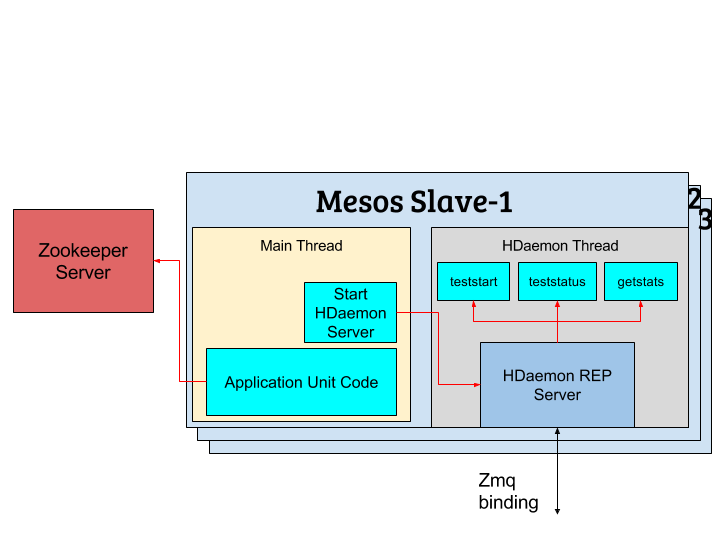
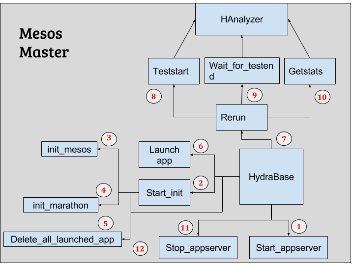
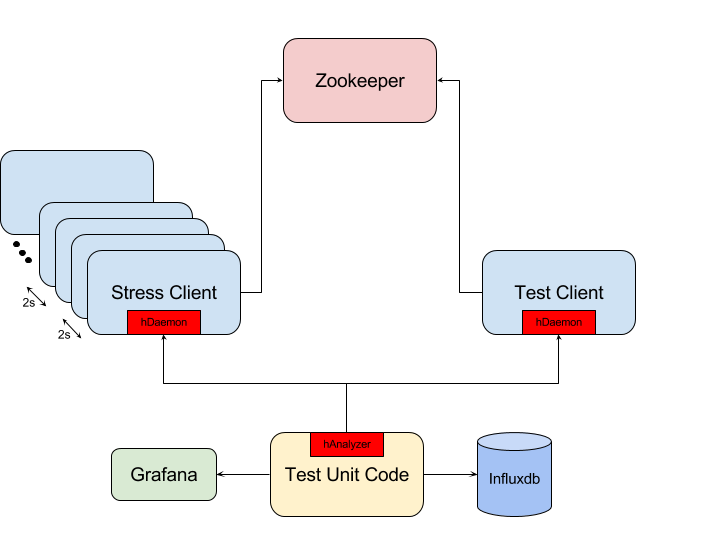

#hZookeeper

##Background:

###Mesos/Marathon: 

[Apache Mesos](http://mesos.apache.org/) is a centralised fault-tolerant
cluster manager. It’s designed for distributed computing environments to
provide resource isolation and management across a cluster of slave
nodes.

In some ways, Mesos provides the opposite to virtualisation:

-   Virtualisation splits a single physical resource into multiple
    virtual resources

-   Mesos joins multiple physical resources into a single virtual
    resource

It schedules CPU and memory resources across the cluster in much the
same way the Linux Kernel schedules local resources.

A Mesos cluster is made up of four major components:

-   ZooKeepers

-   Mesos masters

-   Mesos slaves

-   Frameworks

###Zookeeper:

Zookeeper is a centralized service for maintaining configuration
information, naming, providing distributed synchronization, and
providing group services.

Zookeeper acts as the master election service in the Mesosphere
architecture and stores state for the Mesos nodes.

According CAP theorem, we can’t achieve all three of the availability,
consistency and partition tolerance. Apache Zookeeper guarantees
Consistency and Partition tolerance.

-   **Consistency:** All nodes in a distributed environment see the same
    data at the same time.

-   **Availability:** Guarantee that every request receives a response.

-   **Partition Tolerance:** Even if the connections between nodes are
    down, the other nodes works as guaranteed. (Tolerance to network
    partitions/broken communication)

Distributed applications make use of the services provided by Zookeeper
in one way or another. A lot of work goes into the implementation of
these services which can result in bugs. Even when done correctly, it
increases the complexity. With zookeeper, we don’t have to worry about
these services.

###Hydra:

Hydra is an open-source scale testing tool that is making use of Mesos
and Marathon in the backend. The goal of this project is to stress test
any distributed system with a large number of simulated clients
communicating with the system.

###Hydrospere:

Hydrosphere is a project to setup Mesos/Marathon Cluster along with
Hydra in automated way. This project helps you setting up mesos-marathon
cluster along with [Hydra](https://github.com/lake-lerna/hydra) on
public clouds such as GCE, AWS, Azure. For now, only GCE is supported.

##hZookeeper:

###Introduction:

hZookeeper is a project in which we are going to be scale testing
zookeeper service using Hydra.

### Hydra:

Some of the main components that we are going to use in our project are;

#### HydraBase:

HydraBase is the main library we make use of from Hydra tool. All the
hydra libraries are accessed through this class.

#### mmapi:

This class provides us with the tools to create mesos and marathon
clients. In the backend, it makes use of official mesos and marathon
clients with some extra tweaks to make it more rich and easy to use.
These clients are used later on to perform different actions such
getting app info, deleting apps, creating apps etc

#### appserver:

This library is used to start and stop a http server serving libraries
and packages required by the slaves on a certain port. The content to be
served is stored in ./live directory. This appserver is running in a
separate thread.

#### hAnalyzer:

This library provides a[zmq](http://zguide.zeromq.org/page:all) REQ
client which sends signals to the HDaemon Server running on the slave
node and waits for it’s response. We can send instructions to our stress
app using HAnalyzer. This zmq binding basically provides us with a
common interface through which our stress application can talk to hydra
tool.

#### hDaemon:

This library starts a zmq server which makes use of zmq REQ-REP sockets.
Zmq REP(reply) server basically acts as a service for a set of clients,
receiving requests and sending back the replies. For more details, check
out[zmq guide](http://zguide.zeromq.org/page:all). It listens for the
signals sent from HAnalyzer and responds to them accordingly.

###Example:
Example test is shown in the figure below;

###Scenarios:
We are performing two types of test cases here so far.

####Case-1:
In the first case, we are running different zookeeper operations and observing their affects on eachother.
####Architecture:

##### Start\_appserver:

We need to host all the required packages and libraries on slave nodes.
First it checks whether the files are already populated. In case it’s
not, create ‘/live’ folder and add the files that needs to be on the
slave node. These files are hosted on a port specified in config file,
in our case it’s 9800.

##### Start\_init:

First it creates a Mesos and Marathon client using Hydra’s mmapi. Next
step is to delete all the preexisting applications running on marathon.

##### Launch\_app:

Here we are launching our stress app on the slave nodes using the
Marathon client we created in our previous step, and we are scaling it
if necessary. In hZookeeper, we are running number of clients specified
by the user in different threads. We have fixed the maximum number of
threads per client to a certain number and when the user input clients
number exceeds the maximum number of threads per client, we scale the
marathon app accordingly. Due to some code limitations, it starts some
extra threads which needs to be reduced as much as possible.

##### HAnalyzer:

HAnalyzer can send different signals to the HDaemon server running on
the slave nodes and waits for it’s response. We are using to perform
three operations in our case; to start the test, wait for it to end and
get the stats back.

##### Rerun:

Now that our apps are up and running, we need to tell the apps to start
the stress test. For this HAnalyzer is used which talks to the HDaemon
server running on the slave node. We have registered functions for three
types of signals;

###### Teststart:

This signal is used to notify the stress app running on the slave that
it’s time to start the stress test.

###### Wait\_for\_testend:

This signal checks whether the test has ended or not.

###### Getstats:

When the test ends, we fetch the stats from the app using this signal.

These stats are stored in the influxdb and Grafana is used as plotting
tool which makes use of this influxdb data.

##### HDaemon Server:

It receives signals from HAnalyzer and take some action according to it.
In the end, it sends back the response and starts listening again. This
server is running in parallel with the application unit code.

##### Test unit Code:

Here we are performing all the actions as instructed by the signals
received by HDaemon server.

This code can then appropriately respond to calls/events as we define in
the HDaemon server definition, and run the actual stress request to a
distributed software (Zookeeper in this case). The results, say latency,
response rate etc, can be stored locally to be provided when ever a
request to gets statistics is presented. In our case, we are keeping all
the data in a dictionary named “run\_data”. It constantly checks the
run\_data whether we have received the signal to start the test or not.
Once True, it starts multiple threads depending upon the number of
clients user asked for. Each thread will perform the following
functions;

-   Connects to the zookeeper server

-   Creates the required number of znodes and calculates the latency

-   Reads the data stored in all the znodes and sets a watch on them,
    and calculates the latency

-   Modifies the required number of znodes which triggers the watches.

-   Calculate the delay occurred between znode change and zookeeper
    server notifying us about the change

-   Store all the stats in run\_data dictionary

These stats can be fetched when the *getstats* signal is received from
HAnalyzer

####Case-2:
In this case, we are running two separate apps, one for the test and other for the stress. We either launch reader app or writer app for test which constantly sends read requests towards zookeeper. Stress app sends write requests towards the zookeeper which are increasing constantly with 5 write threads after every 2 seconds. 

After the desired amount of stress threads have been launched, test client is stopped and it's stats are fetched. These stats are stored in influxdb which can be visualized on Grafana later.
